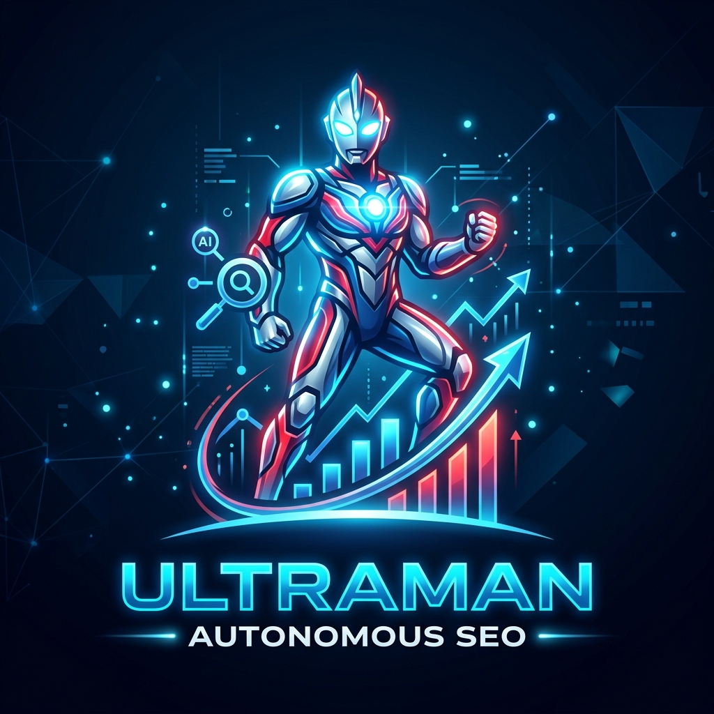
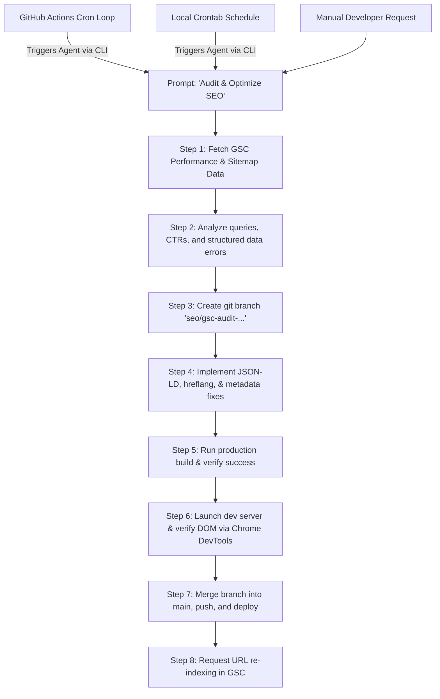

# Ultraman Autonomous SEO

<p align="center">
  
</p>

An autonomous, data-driven, production-grade SEO optimization plugin for **AI Coding Agents** (such as Gemini, Claude, Codex, etc.).

This plugin connects your AI coding agent directly to **Google Search Console** and **Chrome DevTools**, enabling a completely automated and highly disciplined workflow:
1. **Pull real-time performance data** from Google Search Console (via GSC MCP).
2. **Analyze opportunities** (impressions, clicks, CTR, and search queries) according to Google's official SEO guidelines.
3. **Implement optimized modifications** (JSON-LD structured data, metadata, canonicals, hreflang, etc.) in a safe Git branch.
4. **Verify live DOM rendering** after JS/prerendering compilation using Chrome DevTools (via Playwright/Chrome DevTools MCP).
5. **Merge, build, deploy, and request re-indexing**.

---

## 📁 Repository Structure

```
ultraman-autonomous-seo/
├── plugin.json             # Plugin definition & metadata
├── config.example.json     # Global config template
├── install.sh              # One-click Bash installer (macOS/Linux)
├── install.js              # One-click Node.js installer (Cross-platform)
├── README.md               # User guide (this file)
├── rules/
│   └── seo-workflow-rules.md  # Agent rules enforcing safe SEO practices
└── skills/
    ├── gsc-seo-audit/      # Skill: Pull & analyze GSC data, recommend changes
    ├── seo-branch-workflow/# Skill: Git branch creation, builds, commits, and merges
    └── seo-render-verify/  # Skill: Chrome DevTools live DOM verification
```

---

## 🚀 Installation

The plugin installs to a **universal, agent-agnostic location** (`~/.config/ultraman-autonomous-seo/`) and then auto-detects which AI agents are installed on your machine, creating symlinks so every detected agent can find it in its own expected plugin directory.

### Option 1: Using Bash (macOS/Linux)

```bash
git clone https://github.com/your-username/ultraman-autonomous-seo.git
cd ultraman-autonomous-seo
./install.sh
```

### Option 2: Using Node.js (Windows, macOS, Linux)

```bash
git clone https://github.com/your-username/ultraman-autonomous-seo.git
cd ultraman-autonomous-seo
node install.js
```

### Custom install path

If you want to install to a different directory, set the `TARGET_DIR` environment variable:

```bash
TARGET_DIR=/opt/my-agents/plugins/ultraman-autonomous-seo ./install.sh
# or
TARGET_DIR=/opt/my-agents/plugins/ultraman-autonomous-seo node install.js
```

### Auto-detected agents

The installer automatically creates symlinks for the following agents if their config directory is found:

| Agent | Official Plugin Directory | Source |
|-------|--------------------------|--------|
| Gemini (Antigravity CLI) | `~/.gemini/config/plugins/ultraman-autonomous-seo` | Gemini/AGY CLI spec |
| Claude Code | `~/.claude/plugins/ultraman-autonomous-seo` | Claude Code official docs |
| Cursor | `~/.cursor/plugins/ultraman-autonomous-seo` + `.cursor-plugin/plugin.json` | Cursor community spec |
| Windsurf / Devin Desktop | `~/.windsurf/plugins/ultraman-autonomous-seo` | Windsurf/Devin docs |
| Any Agent (generic) | `~/.agents/plugins/ultraman-autonomous-seo` | Open Agent community proposal |

To add support for another agent, manually symlink the install directory:

```bash
ln -s ~/.config/ultraman-autonomous-seo ~/.your-agent/plugins/ultraman-autonomous-seo
```

## 🚨 Prerequisites & Recommended Tools

To get the full power of this automated workflow, we highly recommend installing the following Model Context Protocol (MCP) servers in your agent's environment:

1. **Google Search Console MCP Server** (Required for Step 1: Auditing)
   - Allows the agent to pull real search impressions, keywords, CTR, and indexing status directly from Google.
   - *If missing, the agent will prompt you to enter performance metrics manually.*

2. **Chrome DevTools or Playwright MCP Server** (Required for Step 4: Verification)
   - Allows the agent to navigate to your local dev server or live URL, run javascript, and inspect the rendered DOM (checking meta tags, canonicals, hreflangs, and JSON-LD).
   - *If missing, the agent will skip automated browser inspection and prompt you for manual verification.*

---

## ⚙️ Configuration

The plugin uses a **two-level configuration system**: a global configuration fallback and a project-specific configuration file.

### Step 1: Set up Google Cloud Credentials (GSC)

The plugin requires the Google Search Console MCP server to run. Ensure your Google Application Default Credentials (ADC) are configured:
- Follow Google's guide to create a Service Account in your GCP console.
- Download the credentials JSON key.
- Save it to `~/.config/gcloud/application_default_credentials.json` (or specify its location in your config).
- Make sure your Service Account has **Viewer** or **Owner** access to your property in Google Search Console.

### Step 2: Global vs Project Config

The plugin first looks for a project-specific config file. If not found, it falls back to the global config.

#### 1. Project-level Config (Recommended)
Create a `.seo-config.json` file in the root of your project:

```json
{
  "site_url": "https://your-domain.com/",
  "repo_path": "/Users/username/Code/your-website-repo",
  "build_command": "npm run build",
  "dev_command": "npm run dev",
  "dev_url": "http://localhost:5173",
  "supported_languages": ["en", "zh", "ja", "es"],
  "key_pages": [
    { "path": "/", "schema_types": ["SoftwareApplication", "WebSite", "Organization"], "priority": "homepage" },
    { "path": "/faq", "schema_types": ["FAQPage"], "priority": "high" }
  ]
}
```

#### 2. Global Config (Fallback)
The install script creates a default configuration file at `~/.config/ultraman-autonomous-seo/config.json`. You can edit this file to define default parameters for all projects. This location is agent-agnostic — it works regardless of which AI coding agent you use.

---

## 🛠 Usage

Once installed, your AI agent gains access to the new skills and workflow rules. Simply prompt the agent to perform an SEO audit or verify your site's SEO:

### Example Prompts:
* *"Audit my website's SEO using Search Console data and optimize the pages."*
* *"Create an SEO branch and fix our structured data schemas."*
* *"Verify if my latest SEO metadata changes are correctly rendered in the DOM using Chrome DevTools."*

### The Automated Workflow Your Agent Will Follow:



---

## 🤖 CI/CD & Automation Loops (Optional)

Since this plugin operates on a structured, automated process, you can set it up to run **on a recurring schedule (looping optimization)** in your own website repository using GitHub Actions or a local cron job.

### 1. GitHub Actions (Continuous Optimization)

You can create a workflow file (e.g. `.github/workflows/auto-seo.yml`) in your website's repository to trigger your AI agent to optimize your SEO every week:

```yaml
name: Ultraman Auto SEO Loop

on:
  schedule:
    - cron: '0 0 * * 0' # Every Sunday at midnight
  workflow_dispatch:

jobs:
  seo:
    runs-on: ubuntu-latest
    steps:
      - uses: actions/checkout@v4
        with:
          fetch-depth: 0 # Necessary for branch creation and merges

      - name: Set up Node.js
        uses: actions/setup-node@v4
        with:
          node-version: '20'

      - name: Install Dependencies
        run: npm ci

      - name: Set up GCP Credentials
        run: |
          echo "${{ secrets.GCP_SEO_KEY_JSON }}" > gcp-credentials.json
          echo "GOOGLE_APPLICATION_CREDENTIALS=$GITHUB_WORKSPACE/gcp-credentials.json" >> $GITHUB_ENV

      - name: Trigger AI Agent
        env:
          GEMINI_API_KEY: ${{ secrets.GEMINI_API_KEY }}
          CLAUDE_API_KEY: ${{ secrets.CLAUDE_API_KEY }}
        run: |
          # Command to invoke your preferred agent CLI
          npx -y @google/antigravity-cli@latest run \
            --instruction "Audit website SEO using GSC, implement fixes in a branch, verify build, and merge to main."
```

### 2. Local Cron Job Setup

If you prefer to run the loop locally on your machine, you can create a simple cron runner script (e.g., `scripts/seo-cron.sh`) in your project:

```bash
#!/bin/bash
# Navigate to your website repo
cd /Users/username/Code/your-website-repo || exit

# Run the Agent CLI to trigger optimization
npx -y @google/antigravity-cli@latest run \
  --instruction "Audit website SEO using GSC, implement fixes in a branch, verify build, and merge to main." \
  >> ./seo-optimization.log 2>&1
```

Make it executable: `chmod +x scripts/seo-cron.sh`, and add it to your local crontab:
```bash
# Edit crontab
crontab -e

# Run every Sunday at 2 AM
0 2 * * 0 /Users/username/Code/your-website-repo/scripts/seo-cron.sh
```

---

## 📄 License

This project is open-source and free, licensed under the **MIT License**. Feel free to use, modify, and distribute it!
