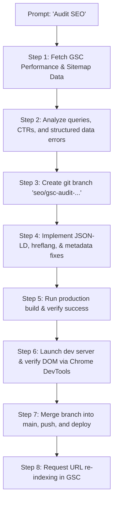

# Antigravity SEO Optimizer Plugin

A data-driven, production-grade SEO optimization plugin for **Antigravity** AI coding agents. 

This plugin connects your Antigravity agent directly to **Google Search Console** and **Chrome DevTools**, enabling a completely automated and highly disciplined workflow:
1. **Pull real-time performance data** from Google Search Console (via GSC MCP).
2. **Analyze opportunities** (impressions, clicks, CTR, and search queries) according to Google's official SEO guidelines.
3. **Implement optimized modifications** (JSON-LD structured data, metadata, canonicals, hreflang, etc.) in a safe Git branch.
4. **Verify live DOM rendering** after JS/prerendering compilation using Chrome DevTools (via Playwright/Chrome DevTools MCP).
5. **Merge, build, deploy, and request re-indexing**.

---

## 📁 Repository Structure

```
antigravity-seo-optimizer/
├── plugin.json             # Plugin definition & metadata
├── config.example.json     # Global config template
├── install.sh              # One-click Bash installer (macOS/Linux)
├── install.js              # One-click Node.js installer (Cross-platform)
├── README.md               # User guide (this file)
├── rules/
│   └── seo-workflow-rules.md  # Agent rules enforcing safe SEO practices
└── skills/
    ├── gsc-seo-audit/      # Skill: Pull & analyze GSC data, recommend changes
    ├── seo-branch-workflow/# Skill: Git branch creation, builds, commits, and merges
    └── seo-render-verify/  # Skill: Chrome DevTools live DOM verification
```

---

## 🚀 Installation

You can install this plugin globally in your Antigravity configuration directory (`~/.gemini/config/plugins/`).

### Option 1: Using Bash (macOS/Linux)

Clone this repository and run the installer:

```bash
git clone https://github.com/your-username/antigravity-seo-optimizer.git
cd antigravity-seo-optimizer
./install.sh
```

### Option 2: Using Node.js (Windows, macOS, Linux)

If you are on Windows or prefer Node.js:

```bash
git clone https://github.com/your-username/antigravity-seo-optimizer.git
cd antigravity-seo-optimizer
node install.js
```

---

## ⚙️ Configuration

The plugin uses a **two-level configuration system**: a global configuration fallback and a project-specific configuration file.

### Step 1: Set up Google Cloud Credentials (GSC)

The plugin requires the Google Search Console MCP server to run. Ensure your Google Application Default Credentials (ADC) are configured:
- Follow Google's guide to create a Service Account in your GCP console.
- Download the credentials JSON key.
- Save it to `~/.config/gcloud/application_default_credentials.json` (or specify its location in your config).
- Make sure your Service Account has **Viewer** or **Owner** access to your property in Google Search Console.

### Step 2: Global vs Project Config

The plugin first looks for a project-specific config file. If not found, it falls back to the global config.

#### 1. Project-level Config (Recommended)
Create a `.antigravity/seo-config.json` file in the root of your project:

```json
{
  "site_url": "https://doodle-sea.com/",
  "repo_path": "/Users/username/Code/doodle-sea-web",
  "build_command": "npm run build",
  "dev_command": "npm run dev",
  "dev_url": "http://localhost:5173",
  "supported_languages": ["en", "zh", "ja", "es"],
  "key_pages": [
    { "path": "/", "schema_types": ["SoftwareApplication", "WebSite", "Organization"], "priority": "homepage" },
    { "path": "/faq", "schema_types": ["FAQPage"], "priority": "high" }
  ]
}
```

#### 2. Global Config (Fallback)
The install script creates a default configuration file at `~/.gemini/config/plugins/seo-optimizer/config.json`. You can edit this file to define default parameters for all projects.

---

## 🛠 Usage

Once installed, your Antigravity agent gains access to the new skills and workflow rules. Simply prompt the agent to perform an SEO audit or verify your site's SEO:

### Example Prompts:
* *"Audit my website's SEO using Search Console data and optimize the pages."*
* *"Create an SEO branch and fix our structured data schemas."*
* *"Verify if my latest SEO metadata changes are correctly rendered in the DOM using Chrome DevTools."*

### The Automated Workflow Your Agent Will Follow:



---

## 📄 License

This project is open-source and free, licensed under the **MIT License**. Feel free to use, modify, and distribute it!
